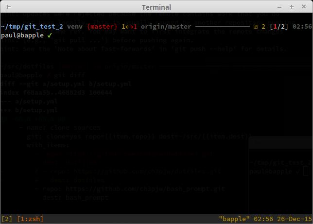

zsh_prompt
==========

This is a re-implmentation of my `bash` prompt, which can be found at
https://github.com/ch3pjw/bash_prompt.

This `zsh` prompt clearly and consisely lays out a whole bunch of useful status
information to make your `zsh` session an even more joyous experience!  The main
design ethos was to break apart output from individual commands very clearly,
show status information only when needed and place information on the screen
where it's most relevant.  So, for example, I place a blank line and horizontal
rule between each command, display the exit status as a coloured UTF character
right next where you're contuing your train of thought and place the completion
time of your previous command way over to the right, so it's there if you want
it but not cluttering your line of sight.

Features include:
* Dynamic layout (resizes according to the width of your terminal, truncates
  long working directory path if necessary)
* Previous command exit status and completion time
* Git status (including ahead/behind)
* Number of background jobs (including stopped jobs)
* Number of connected tmux sessions
* Native zsh + awk

